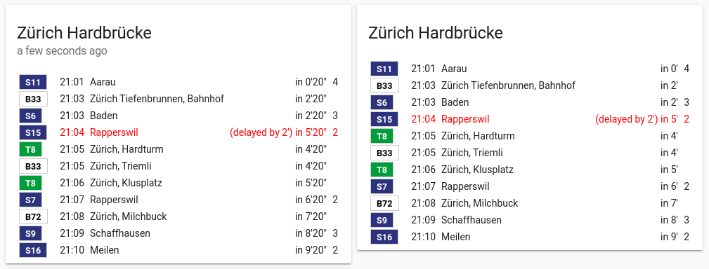

# Lovelace Swiss Public Transport Card

Custom card for the Swiss Public Transport integration for Home Assistant
Lovelace UI.



:warning: The card currently needs a swiss-public-transport integration still in
development (see https://github.com/home-assistant/home-assistant/pull/30715).

## Installation

1. Download and copy `swiss-public-transport-card.js` from
   [this repository](https://github.com/agners/swiss-public-transport-card/raw/master/swiss-public-transport-card.js)
   into your `config/www` directory.

2. Add a reference to `swiss-public-transport-card.js` inside your
   `ui-lovelace.yaml` or at the top of the raw config editor UI:

```yaml
  resources:
  - type: js
    url: 'https://unpkg.com/moment@2.22.2/min/moment.min.js'
  - type: js
    url: /local/swiss-public-transport-card.js?v=0.0.1
```

## Using the card

Make sure you have an Swiss public transport stationboard sensor setup as
follows:

```yaml
- platform: swiss_public_transport
  name: Zürich Hardbrücke
  limit: 6
  stationboard:
  - Zürich Hardbrücke, Bahnhof
  - Zürich Hardbrücke
```

Add a manual card with the following configuration to your Lovelace UI:
```yaml
type: 'custom:swiss-public-transport-card'
entity:
  - sensor.zurich_hardbrucke
```

### Card options

The card has the following additional options:

- entity (mandatory): the entity name of the sensor providing stationboard
  entries.

- departure_countdown: time in minutes before departure when a remaining time
  value is displayed. Use 0 to disable remaining time display. Default: 15

- show_last_changed: Show when the sensor last changed its data

- show_seconds: Show remaining time with second accuracy

## Troubleshooting

Check "States" in Developer Tools if your entity name is correctly setup. Also
make sure the backend was able to fetch departures (verify that Objects are in
the `departures` attribute).

If the card sometimes is not displayed on first load and/or your browsers
JavaScript console displays `ReferenceError: moment is not defined` errros, make
sure to include moment.js first. You might also try to download it locally into
your `conf/www` directory and reference it as follows:

```yaml
  resources:
  - type: js
    url: /local/moment.min.js?v=2.22.2
```

## Supporting Development

[](https://www.buymeacoff.ee/agners)
